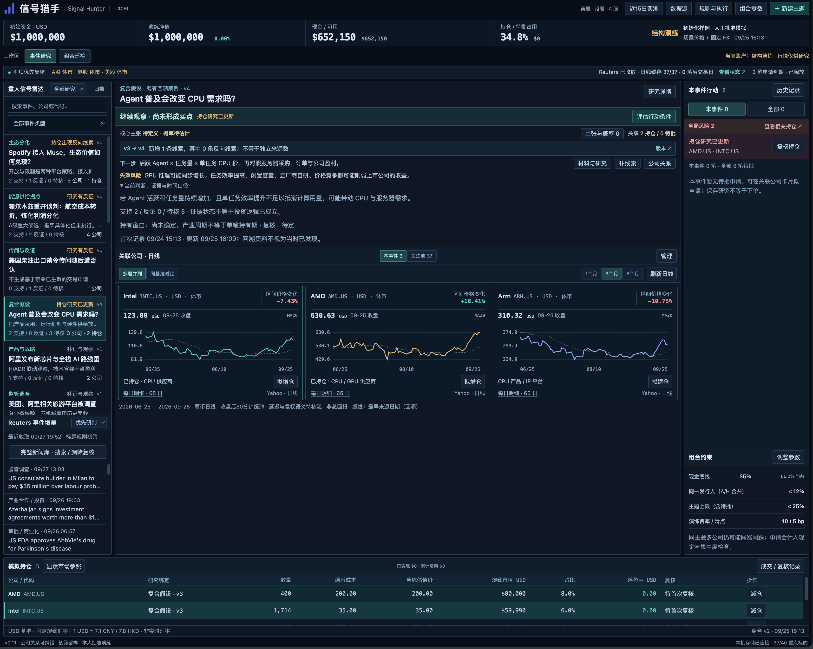
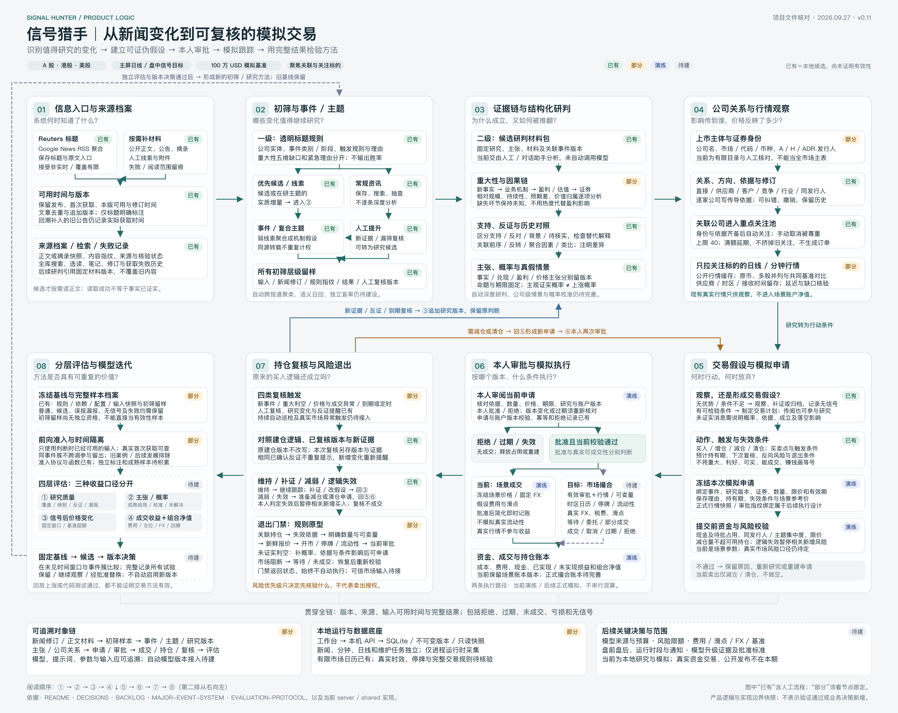

# Signal Hunter · 信号猎手

**From news developments to reviewable trading hypotheses.**

Signal Hunter is a local workbench for major-event research and paper-trading workflows across mainland Chinese A-shares, Hong Kong stocks, and US equities. It brings news, evidence, counter-evidence, related companies, daily charts, proposals, and position reviews into one research context.

It helps researchers ask: **What changed? Why might it matter? Which companies are exposed? What is already priced in? When should we act—or abandon the hypothesis?**

**v0.11.0 · Early preview · MIT · Local, single-user tool**

[简体中文](README.md) · English

[Quick start](#quick-start) · [Research workflow](#research-workflow) · [Capabilities](#current-capabilities) · [Documentation](#documentation-and-development) · [Contributing](CONTRIBUTING.md)



*Screenshot from a development research instance. Its research, observed market prices, and scenario positions are not the default installation data or evidence of actual returns. The public package excludes that instance's database and original news archive. A new installation opens a separate synthetic demo.*

## Why Signal Hunter

A news item is not yet a trading signal. A development worth researching might be an acquisition, a regulatory decision, sustained product adoption, or several weaker clues pointing toward the same change. Effects may propagate through suppliers, customers, competitors, and markets.

Signal Hunter makes that reasoning inspectable and revisable:

- **Organize around events.** Screen developments first, then attach supporting evidence, counter-evidence, and unresolved material to events or composite themes.
- **Connect companies to the thesis.** Record relationship types, direction, and evidence; follow identified securities and compare daily charts side by side or on a common base.
- **Represent uncertainty.** Rumours can enter research. Keep the probability of a claim being true separate from business realization and price outcomes.
- **Make actions explicit.** Prepare open, add, reduce, or close proposals; the user approves or rejects them before the simulation proceeds.
- **Revisit the original reasoning.** New evidence and research versions feed position reviews while preserving earlier judgments and outcomes for later evaluation.

The tool is intended for individual researchers, event-driven strategy exploration, and developers building traceable research workflows. The application interface is currently mainly Chinese. Automated analysis and effectiveness evaluation remain under development.

## Quick start

Install **Node.js 24.15+ within the 24.x line** and its bundled npm. The recommended version is in [.nvmrc](.nvmrc). Dependency installation requires network access; the default demo does not request news, quotes, or model services at runtime.

Download and extract this repository, then open a terminal at its root:

```sh
cd prototype
npm ci --ignore-scripts
npm start
```

When the terminal reports that the workbench is ready, open [http://127.0.0.1:4178](http://127.0.0.1:4178/). Keep the terminal running; **Ctrl+C** stops both the web app and API.

The offline demo contains **3 fictional themes, 9 associated securities, synthetic daily charts, a USD 1,000,000 scenario book, 5 initial positions, and 3 pending proposals**. Real ticker symbols illustrate the three-market interface; the events and curves are synthetic. No account, API key, model service, or deposit is required.

A first walkthrough:

1. Select a fictional theme in the event radar and inspect its thesis, evidence, and counter-evidence.
2. Compare the related companies using the chart grid or common-base view, and inspect relationship evidence.
3. Open “组合” (Portfolio), then expand the advanced scenario book to inspect proposals, reserved cash, and positions; approve or reject a demo proposal.
4. Review the saved research and decision versions to see how the workflow preserves earlier judgments.

Demo changes persist across restarts. Run `npm run health` from another terminal in `prototype` to check the web app, API, and proxy. See the [operations guide](prototype/README.md) for port conflicts, backups, and starting a fresh demo.

## Workspace navigation

The primary navigation is Workspace / Portfolio / Evaluation (工作台 / 组合 / 评估). The existing dark layout now has five areas: overall status, event changes, research and charts, global risks with decisions and monitoring, and a persistent positions summary. The home view groups research only by current, explicit event-cluster membership; one event entry expands into the separate research records, sources and changes. Stale membership falls back to individual entries without rewriting records. Priority entries and counts lead to full lists one level deeper; selection and expansion survive detail and list returns. Event selection highlights associated positions without hiding other risks. Aggressive and steady market simulations and the scenario book remain separate; unavailable values are shown as unknown.

Background progress opens the existing activity log and technical tasks. Reading, expanding, and switching accounts does not run research or approve orders. Nested details return to the prior research and position context. With local Codex configured, “启动自动研究” starts news intake and research using the current sources and call budget. New inputs progress through saved bodies, scoped events, conservative company associations and versioned system dossiers without manual intermediate adoption. Ambiguous identities remain unknown; bounded retries preserve failures and user edits. System judgments are not human verification and never create or approve orders. “运行详情” opens diagnostics. Opted-in entries can now save system relationship judgments, create the first event cluster and expand it only when every member pair agrees. Unknown or conflicting results remain observations; prior human decisions are preserved. Evidence enrichment, revised-event succession, larger cluster coverage and conditional proposals remain later milestones in the [product blueprint and 1.0 roadmap](docs/PRODUCT-BLUEPRINT.md).

Research detail has five groups: summary, evidence, company and prices, action, and history. Scenario books and minute charts are advanced sections. Sources, task controls, budgets and backups are under Settings. Legacy UI links redirect to the unified workspace without changing the dataset or runtime mode. See [the backlog](docs/BACKLOG.md) for the candidate's deployment status.

## Start your own research

The current development candidate adds a company research drawer, a compact watch table, selected daily comparisons, and per-topic navigation context within the browser session. Company impact fields remain manual and versioned; missing analysis is visible. Direct company citations are separated from topic background, and existing positions retain their opening research version.

News discovery now has separate broad and keyword queries, each with controls and collection receipts. Receipts show returned publication ranges, accepted/rejected counts, revisions, errors, and possible truncation at 100 results. Both queries use the same aggregation source and do not count as independent evidence. These changes are under review; see [the backlog](docs/BACKLOG.md) for implemented scope and remaining work.

Stop the demo, then run this from `prototype`:

```sh
npm run start:research
```

Research mode uses a **separate, empty research database**. It imports no demo themes, watchlist, positions, or orders. Create a theme using “＋ 新建主题”, or turn a news item into a draft. The scenario book starts with USD 1,000,000 in illustrative cash.

| Mode | Command | Database, relative to the repository root | Inputs |
| --- | --- | --- | --- |
| Offline demo | `npm start` | `data/runtime/demo.sqlite` | Original synthetic fixtures; server-side external data requests disabled |
| Your research | `npm run start:research` | `data/runtime/research.sqlite` | Online news links, public quotes for followed companies, and on-demand material |

Research mode attempts to retrieve **Reuters headline links aggregated through Google News RSS** and public market data for followed companies. This is not an officially licensed Reuters API and carries no promise of real-time delivery, completeness, or continued availability. Article reading is on demand, with local storage. Check source status and timestamps in the app.

Database mode checks prevent opening an existing database in the wrong mode. See the [operations guide](prototype/README.md) for the compatibility-only `legacy` mode, port settings, and `SIGNAL_DB_PATH`. The launcher reads process environment variables; it does not automatically load `.env` files.

## Event continuity candidate

The event-tracking panel retrieves repeated headlines, stage differences, possible counter-evidence, industry analogies and related research. Each suggestion retains input versions and matching reasons. Keep a link, dismiss it or reopen it; the decision history remains available. New input revisions require a new review. Links organize leads without rewriting evidence or paper orders.

Priority reflects research urgency and held-company exposure, not materiality or price probability. Publisher families are not counts of independent reporting. Indexing is bounded and runs in the background; failures retain previous results and remain visible. Full-text semantic recognition and held-out accuracy evaluation are still pending.

The latest development candidate can continue an event cluster automatically after a source revision: all revised occurrences are compared with retained members, and only a unique match advances the original cluster ID. Prior research, decisions and membership versions remain intact. Superseded research is accessible inside the event history rather than appearing as a separate current event; its holdings risks remain visible. Historical views are labeled and can return to the current successor. A revised source with no occurrence or an intervening user edit records an observation instead of waiting indefinitely. When no current anchor remains, or one document has multiple old occurrences, a complete old-by-new matrix must establish a unique one-to-one mapping before a separate current-member consistency check. Ambiguity and oversized comparison sets remain observations. Aggregate research, automatic evidence supplementation and wider recall remain incomplete. This bounded path is not complete automatic research or an RC release. See the [current backlog](docs/BACKLOG.md).

## Research workflow

**Inputs → events and themes → evidence → companies and charts → proposals → human decisions → position reviews → layered evaluation**

| Stage | Question | Current output |
| --- | --- | --- |
| Inputs and screening | When did we know? Is this worth further research? | Sources, first-seen timestamps, revisions, and title-screening samples |
| Structured research | What supports the claim? What would invalidate it? | Events or themes, evidence and counter-evidence, claims, probabilities, and research versions |
| Companies and charts | Who is exposed? What has price reflected? | Relationship evidence and revisions, a focused watchlist, and comparable daily charts |
| Hypotheses and proposals | When should we act, hold, or stop? | Triggers, invalidation conditions, expected holding periods, quantity/limit/expiry, and risk checks |
| Human decisions and simulation | Do we accept this version and these conditions? | Approval/rejection/expiry records, scenario fills, cash, and positions |
| Review and evaluation | Does the thesis still hold? Is the method useful? | Review records and new proposals; an evaluation protocol, with full automated evaluation still planned |

### Product logic map



[Open the full-resolution map](docs/assets/product-logic.png). Its labels distinguish **implemented, partial, scenario-only, and planned** capabilities. They describe implementation scope, not proven trading performance. See [image notes](docs/assets/README.md) for context.

## Current capabilities

| Available | Boundary |
| --- | --- |
| Title-rule screening, news search, and manual missed-event review | Rule-based cross-report candidates only; no full-text semantic clustering or validated detection accuracy |
| Versioned evidence, material, research, claims, and counter-evidence | Research instances can use configured local Codex for reviewable candidates; offline demos do not call a model |
| A-share / Hong Kong / US company relationships and automatic following | The company catalog is limited; identities, exposure, and cross-market mappings need review |
| Daily chart grids, common-base comparison, and minute-data observation | Public sources may be delayed or incomplete; adjustment, calendar, and provider differences need validation |
| Proposals, human decisions, risk checks, and position review | Frozen scenario prices, fixed FX, and simplified fees; observed quotes do not drive book NAV |
| Input samples, version history, and an evaluation protocol | Independent holdout metrics, probability calibration, and strategy return validation are unfinished |

Scenario fills exercise the workflow. They do not model real liquidity, partial fills, settlement restrictions, price limits, or complete taxes and fees. **There is no broker order integration. Passing tests, screenshots, and retrospective examples do not establish profitability or strategy validity.**

The app is local and single-user, listening on `127.0.0.1`. Approval is a workflow action, not identity authentication; do not expose the ports directly. Read the [security policy](SECURITY.md) and the [data policy](docs/DATA-POLICY.md).

## Documentation and development

The workbench uses **React + Vite**, a **Node.js HTTP API**, and **Node's built-in SQLite**. The frontend reaches the API through a same-origin `/api` proxy. Inputs, research, and simulation decisions retain versions. No separate database server is needed.

| Document | Contents |
| --- | --- |
| [Operations guide](prototype/README.md) | Commands, ports, modes, backups, and troubleshooting |
| [Architecture](docs/ARCHITECTURE.md) | Module responsibilities, data flow, and boundaries |
| [Research rules](docs/MAJOR-EVENT-SYSTEM.md) | Materiality, transmission, proposals, review, and exits |
| [Evaluation protocol](docs/EVALUATION-PROTOCOL.md) | Availability time, event isolation, baselines, and holdouts |
| [Backlog](docs/BACKLOG.md) / [Decisions](docs/DECISIONS.md) | Canonical progress and decisions |
| [Changelog](CHANGELOG.md) | Version scope and release notes |
| [Contributing](CONTRIBUTING.md) | Development, checks, and pull requests |
| [Source releases](docs/OPEN-SOURCE.md) | Reviewable exports, checksums, and publication steps |

Most detailed documentation is currently in Chinese. Run the development checks from `prototype`:

```sh
npm test
npm run build
npm run release:check
```

Upcoming priorities include company-level impact and alternative explanations, event-detection evaluation, position risk review, and simulation under real market constraints. The [backlog](docs/BACKLOG.md) tracks status and dependencies. Reproducible issues, synthetic examples, and focused PRs are welcome.

## License

Original software and documentation are licensed under the [MIT License](LICENSE), copyright Signal Hunter contributors. Third-party news, market data, trademarks, and dependencies retain their own rights; MIT does not automatically grant redistribution rights for them. See [third-party notices](THIRD_PARTY_NOTICES.md) and the [data policy](docs/DATA-POLICY.md).
